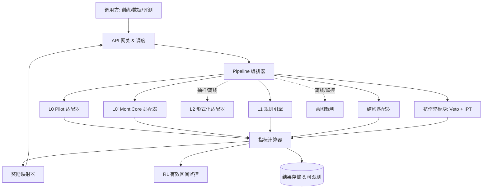
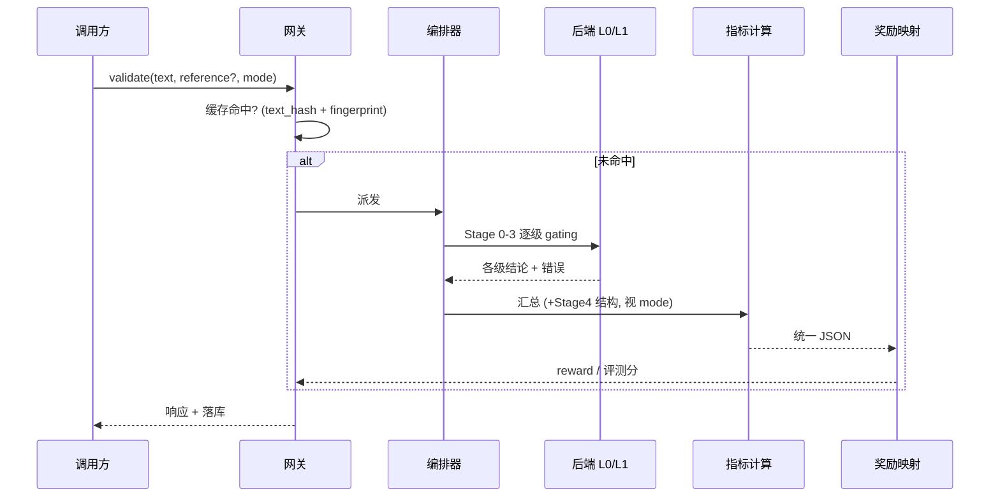

# SYVERN 概要设计文档(HLD)

> **SYVERN** = *SysML V2 EValuation & Reward eNgine*
> *SysML v2 生成的守门人:分层校验,评测即奖励,作弊过不了关。*
>
> 文档级别:概要设计(High-Level Design)。配套《SYVERN 详细设计文档(LLD)》《SFT 阶段执行文档》。

---

## 1. 引言

### 1.1 目的
本文档定义 SYVERN 的总体架构、模块划分、组件职责、模块间接口与关键设计决策,作为详细设计与开发的依据。

### 1.2 范围
SYVERN 是 SysML v2 生成任务的统一校验/评测/奖励服务,覆盖:SFT 数据过滤、训练评测与回归、RFT 拒绝采样筛选、RLVR 在线奖励。不含:模型训练框架本身、数据合成 pipeline(见《SFT 阶段执行文档》)。

### 1.3 术语与缩写
| 术语 | 含义 |
|---|---|
| T0/T1/T2 | 信号收敛分层:完全收敛核心 / 条件收敛 / 不收敛 |
| Stage 0–5 | 逐级校验阶段:解析/名称解析/类型检查/规则/结构/意图 |
| IPT | Isomorphic Perturbation Testing,同构扰动测试 |
| Veto | 否决层,触发即奖励置零的硬边界 |
| RFT | Rejection-sampling Fine-Tuning,拒绝采样微调 |
| Fingerprint | 验证器版本指纹,保证结果可复现 |

### 1.4 参考
SysML v2.0 / KerML 1.0 / Systems Modeling API & Services 1.0(2025);SysML v2 Pilot Implementation;MontiCore SysML v2;Imandra / Gamma / nuXmv;metamodel-driven validation;IPT(RLVR reward hacking)。

---

## 2. 设计目标与约束

### 2.1 设计原则
1. **评测 = 奖励**:同一套校验逻辑产出同一份 JSON,SFT 阶段定字段口径,RL 阶段只调权重。
2. **收敛分层**:仅 T0 进确定性奖励,T1 降权辅助,T2 仅监控/偏好。
3. **服务化、无状态、可缓存、幂等**:支撑 RL 在线高吞吐。
4. **版本钉死可复现**:后端版本写入指纹并入每条结果。
5. **抗作弊优先于召回**:否决层是硬边界,宁漏报不给作弊高奖励。

### 2.2 非功能性需求
| 维度 | 要求 |
|---|---|
| 确定性 | T0 同输入同输出;结果随指纹可复现 |
| 吞吐 | `online_reward` 模式单条 < 数百 ms,支持批量并发 |
| 可扩展 | 规则层、后端适配器、指标项可插拔 |
| 可观测 | 每条结果落库,按 tier/domain/difficulty/checkpoint 分层对比 |
| 安全边界 | 作弊检出即置零;裁判不入确定性奖励 |

---

## 3. 收敛范围分层模型(设计骨架)

SYVERN 的可信边界由收敛分层定义,决定每个信号能否进奖励、以什么权重进。判定四性质:确定性、有界性、参照无关性、梯度有意义。

| 层 | 信号 | 用途 |
|---|---|---|
| **T0 完全收敛** | 解析 / 名称解析 / 类型检查 / 元模型规则 | 确定性奖励主信号 |
| **T1 条件收敛** | 结构 F1 / GED / 需求覆盖率 | 降权辅助奖励(需冻结参照与匹配策略) |
| **T2 不收敛** | 意图保真(LLM-judge) | 仅监控 / RLHF 偏好,禁入 RLVR |

两条边界约束贯穿全设计:
- **收敛 ≠ 正确**:T0 全过只证明良构性 + 名称/类型一致性 + 已实现规则,不证明系统建对了。规则层可把边界外推,但到不了"真实正确"。
- **RL 有效区间**:reward 仅在与真实质量同向时有效;策略刷满 T0 后会钻缝(reward hacking),需在线监控发散点(§10.3 监控)。

---

## 4. 总体架构

### 4.1 架构图



### 4.2 数据流



### 4.3 部署形态
单一无状态服务,水平扩展;按 `(text_hash, fingerprint)` 缓存。`online_reward` 模式只走 L0+L1(高吞吐);`full` 模式含 L0'/L2/IPT/结构匹配;`data_filter` 模式跑到 Stage 3 并应用门控阈值。

---

## 5. 模块划分

| 模块 | 职责 | 服务层 |
|---|---|---|
| API 网关 & 调度 | 接入、模式路由、缓存、并发、幂等 | — |
| Pipeline 编排器 | 逐级 gating、按 mode 决定跑到哪一 Stage、状态机 | — |
| L0 Pilot 适配器 | 调官方参考实现:解析/名称解析/类型检查;错误归一化;指纹 | T0 |
| L0' MontiCore 适配器 | 第二解析器,产出与 L0 的一致性结论 | T0(鲁棒性) |
| L1 规则引擎 | 元模型派生规则 + 抗作弊规则,带严重度 | T0 |
| L2 形式化适配器 | Imandra / Gamma / nuXmv,深度语义/契约,抽样离线 | T0+(离线) |
| 结构匹配器 | 元素规约、规范化匹配、可选语义对齐;冻结策略 | T1 |
| 抗作弊模块 | Veto 规则 + IPT 同构扰动 | 硬边界 |
| 意图裁判 | LLM-judge + 校准 | T2 |
| 指标计算器 | 汇总各模块产出为统一指标 JSON | — |
| 奖励映射器 | JSON → 奖励标量,含否决门 | — |
| RL 区间监控 | coverage×pass 散点、发散检测、stable@k | — |
| 结果存储 & 可观测 | 落库、分层对比、仪表盘 | — |

---

## 6. 后端选型与策略

- **L0 官方 Pilot Implementation**(Xtext):权威主判决,Stage 0–2 来源。校验约束随版本变,**必须钉版本并写入指纹**。
- **L0' MontiCore**:独立第二解析器,产出 `parser_agreement`;不一致样本不进奖励或降权。
- **L1 规则引擎**:从 SysML v2 元模型派生校验规则(而非手写),是把 T0 边界外推的主要手段;抗作弊规则也驻留此层。
- **L2 形式化**:Imandra(SysML-v2→IML)、Gamma、nuXmv(符号模型检验,可作 Gamma 等框架的后端引擎)。慢,仅里程碑/抽样,**不进在线奖励**。

在线奖励用 L0+L1(钉版本、缓存);L0' 交叉与 L2 周期性校准。

---

## 7. 校验 Pipeline 概述

```
Stage 0 PARSE      解析成功?            [T0]
Stage 1 RESOLVE    引用可解析?          [T0]
Stage 2 TYPECHECK  类型/KerML 约束?     [T0]
Stage 3 CONSTRAINT 元模型规则 + 抗作弊    [T0 / 否决层]
─────────── 以下需参照 ───────────
Stage 4 STRUCTURAL 与参照结构匹配         [T1]
Stage 5 INTENT     意图保真(LLM-judge) [T2,仅监控/偏好]
```
逐级 gating:任一 Stage 失败,后续标记"未达到"(区别于"未评估"),天然形成阶梯式 reward shaping。Stage 0–3 不依赖参照,可对任意采样运行。

---

## 8. 接口概述

- **服务接口**:`POST /validate {text, reference?, mode}` → 统一 JSON;`mode ∈ {online_reward, full, data_filter}`。
- **输出**:统一 JSON,含 `tier_summary / stage / structural / robustness / intent / veto / monitor / meta`(详见 LLD §3)。
- **奖励消费**:RL 训练侧读 `奖励映射器` 输出的标量;评测侧读分层指标;数据侧读门控布尔。

---

## 9. 关键设计决策与权衡

| 决策 | 理由 | 被否方案 |
|---|---|---|
| 评测器与奖励器统一 | 避免两套口径漂移;SFT 工程直接复用到 RL | 评测/奖励各搞一套 |
| 仅 T0 进确定性奖励 | 只有确定性核心可复现、抗作弊 | 把结构/意图也直接进奖励 |
| 双解析器交叉 | 抓单解析器漏报,提升稳健性 | 仅信任单一官方解析器 |
| Veto 作硬边界(置零) | 空模型/枚举式作弊靠扣分压不住 | 仅以扣分惩罚作弊 |
| 意图裁判保持简单(非 agentic) | 打分一致性与流程复杂度成反比 | 多步 agentic 评审框架 |
| 句法相似度仅监控 | CodeBLEU 双向误导(假阳/假阴) | 把 CodeBLEU 进主指标 |
| 匹配策略冻结入指纹 | 保证 T1 跨时间可复现 | 匹配策略可随时调 |

---

## 10. 运行视图与监控

### 10.1 模式与吞吐
`online_reward`(L0+L1,< 数百 ms)/ `full`(全 Stage + IPT)/ `data_filter`(到 Stage 3 + 阈值)。

### 10.2 缓存与幂等
按 `(text_hash, validator_fingerprint)` 缓存,幂等;指纹变更自动失效旧缓存。

### 10.3 RL 有效区间监控
在线看 `semantic_pass × requirement_coverage` 散点:同时往右上=健康;只往右不往上=进入作弊区、reward 失效预警。配 `stable@k` 确认信号未在噪声中漂移。

---

## 11. 风险与缓解

| 风险 | 缓解 |
|---|---|
| 后端版本漂移致结果不可复现 | 钉版本 + 指纹 + 缓存失效 |
| 奖励黑客(空/枚举/格式作弊) | Veto 置零 + IPT + 覆盖项必留 |
| T1 参照不唯一 | 降权 + 冻结策略 + 仅作辅助 |
| LLM 裁判偏置 | 简单 rubric + 交换平均 + 跨模型 + κ 校准,禁入奖励 |
| 形式化工具慢拖垮在线 | L2 仅抽样/离线,在线只 L0+L1 |
| 解析器分歧 | `parser_agreement=false` 不进奖励 |
